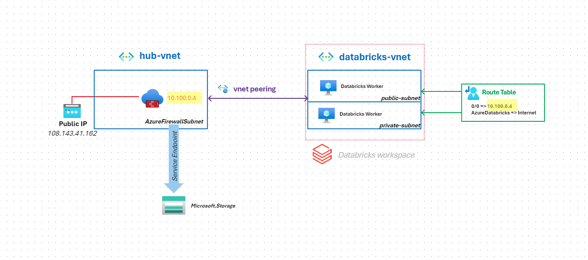
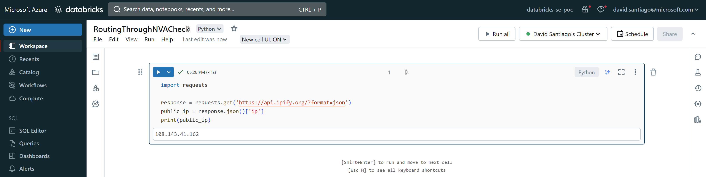
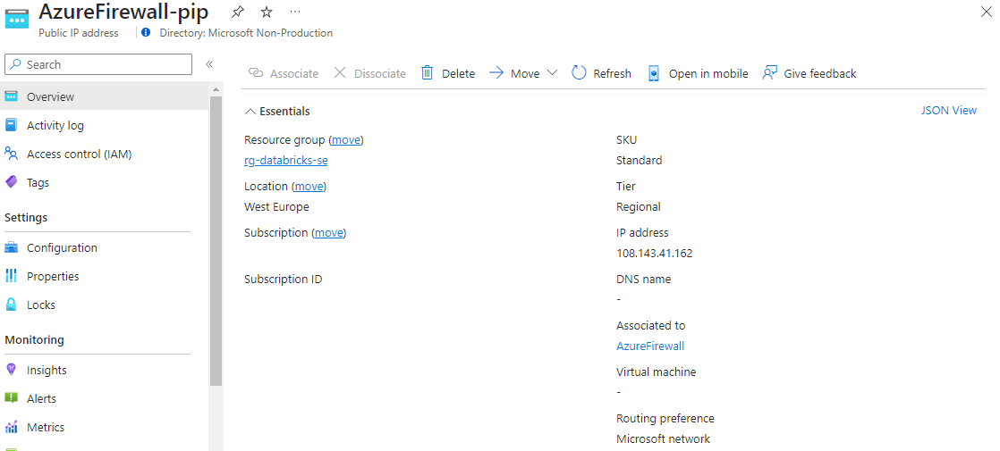

# Azure Databricks - Route workers traffic through NVA

## Overview

Routing the traffic of Azure Databricks Service workers is possible, by configuring the routing on the ***public*** and ***private*** subnets.

**Example**:



In the previous example, the traffic of the workers is routed through *AzureFirewall*. This is useful for filtering traffic, inspections, etc.

This configuration also addresses a limitation of Azure Databricks Service today: the fact that this service does not support [Services Endpoints](https://learn.microsoft.com/en-us/azure/virtual-network/virtual-network-service-endpoints-overview).

By activating service endpoints on the subnet of the NVA (Azure Firewall here):
* Traffic between *AzureFirewall* and Azure PaaS services is free
* Nevertheless, traffic between `databricks-vnet` and `hub-vnet` is not free: [VNet peering costs apply](https://azure.microsoft.com/en-us/pricing/details/virtual-network/).

## Quickstart

To begin the Terraform deployment, following these steps:

* Sign in to Azure Cloud shell at https://shell.azure.com/ or use your local terminal

* Clone the current GitHub repository with the command:

`git clone https://github.com/davidsntg/azure-databricks-with-nva`

* Navigate to the new folder microhack-azure-panfw/ and initialize the terraform modules with the commands:
  
`cd azure-databricks-with-nva`

`terraform init`

* Start the deployment by running:

`terraform apply`

* When prompted, confirm the start of the deployment by responding with a yes.

* Wait for the deployment to finish, which should take approximately 10 minutes.

## Check workers outbound Public IP

* Open the Azure Databricks Service Workspace in the resource group `rg-databricks-se`
* Create a Compute cluster
* Create a new notebook and run the following code:

```python
import requests

response = requests.get('https://api.ipify.org/?format=json')
public_ip = response.json()['ip']
print(public_ip)
```



* Check that hte displayed IP is the public IP of the firewall:



👏👏, workers traffic is now routed through the NVA.
